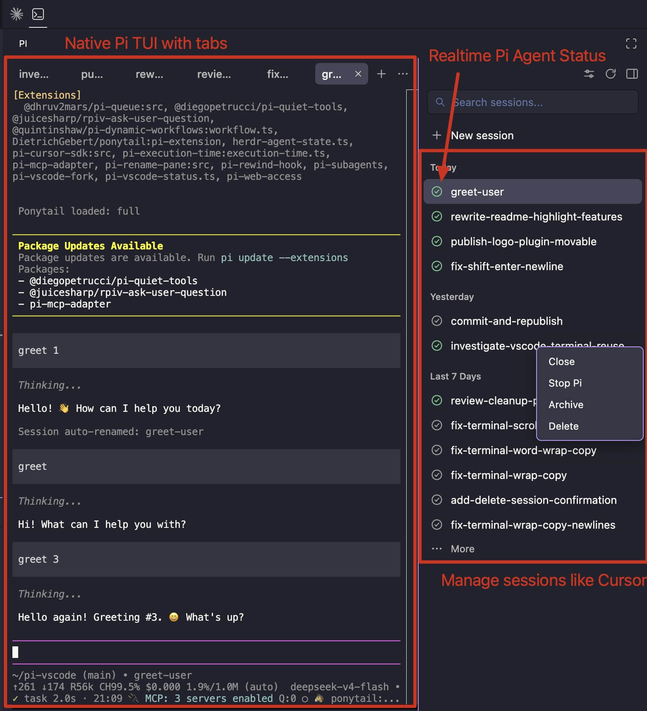
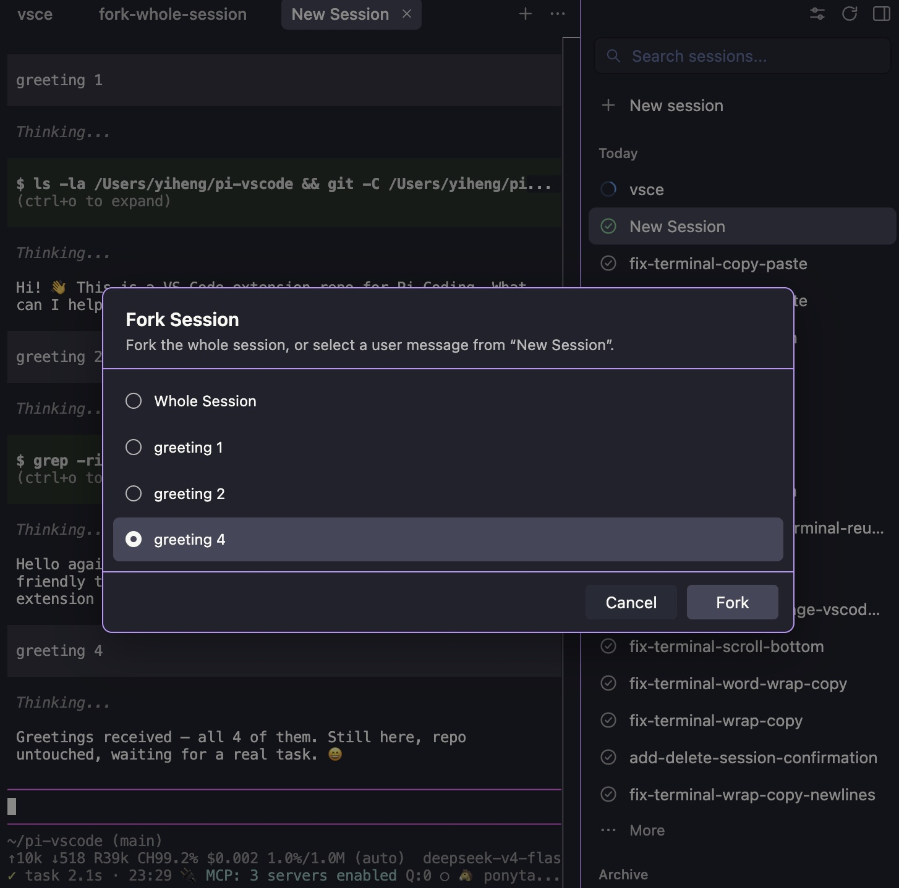
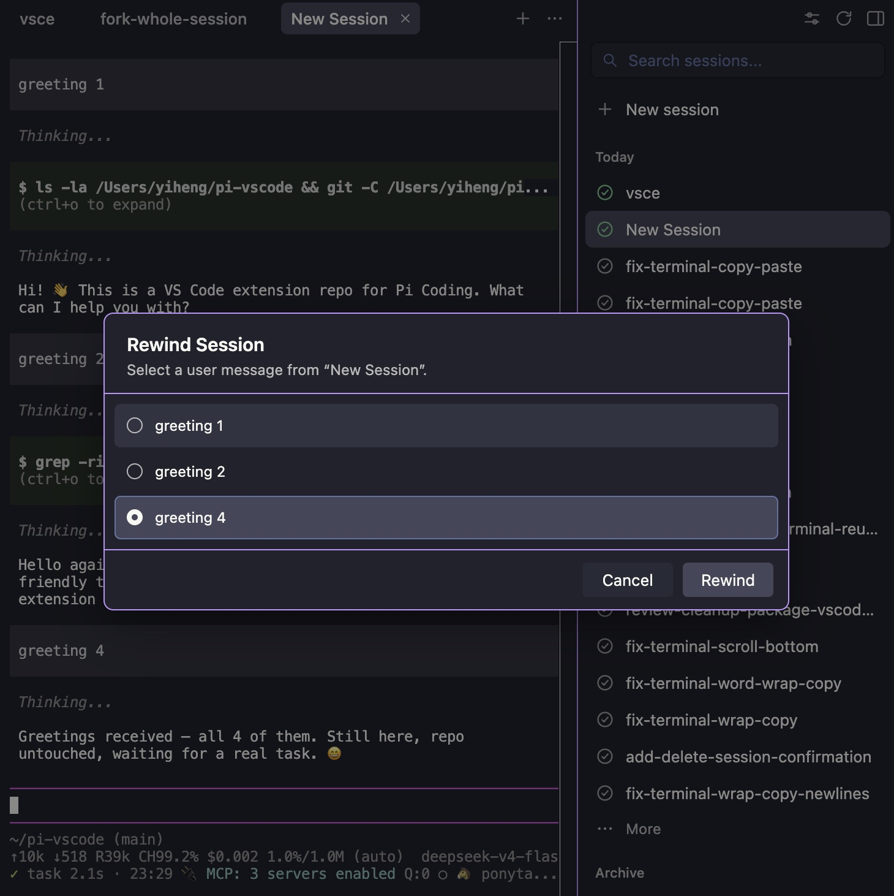

# Pi for VS Code

Run [pi coding agent](https://pi.dev) sessions in VS Code. The Secondary Side Bar keeps the workspace's session list and controls; the selected Pi session appears in a native Terminal Editor in a dedicated locked group to the right of your files.

Install from the [VS Code Marketplace](https://marketplace.visualstudio.com/items?itemName=EthanChow.pi-coding).





## Highlights

- **Live status per session.** Each entry shows what Pi is doing: a spinning blue glyph while it works, green when it is waiting for your input, gray when it is stopped. No need to keep a terminal in view to know whether the agent is still going.
- **Native terminal behavior.** Pi uses VS Code's own terminal surface, so terminal keybindings, IME input, find, selection, accessibility, themes, shell keyboard protocols, and user terminal settings follow VS Code directly.
- **Click paths to open files.** ⌘-click (Ctrl on Windows/Linux) any path Pi prints and it opens in the editor at the right line and column. Paths like `src/file.ts:12:3` and paths wrapped across terminal rows work; keyboard-copying wrapped Pi output restores the original line.
- **Session management.** Browse every session for the current workspace in the list, grouped by `Today` / `Yesterday` / `Last 7 Days` / `Last 30 Days` / `Older` / `Archive`. Resume, archive, close, or delete sessions from the list. Open terminals are remembered per workspace and reopened next time.
- **Fork and rewind sessions.** Right-click a session and pick **Fork** or **Rewind** to branch from, or go back to, any earlier user message. Fork opens the copy in a new tab; Rewind rewinds the session and restarts Pi with the message ready to re-send. Both are disabled while Pi is working. Rewind can also restore files to the state captured before the message — the checkpoint is a Git object in the transcript and never touches the real index; restoring files requires a Git repository.
- **Audio cue.** A short tone plays when a session goes from working to waiting — so you can start a task, switch away, and get told when it is done or needs input.
- **Agent panels (opt-in).** With the companion Pi package installed, a Pi session can spawn sibling Pi sessions in background tabs and drive them — prompt, wait for completion, list — so one orchestrator can fan reviews out to parallel agents and run fix/verify loops. See [Agent panels](#agent-panels).

## Session list

- One entry per session, newest first. The title is the latest `session_info.name` from the session's JSONL transcript; sessions without one show `New Session`.
- Click an entry to focus its native terminal, recreate a detached terminal with its screen and scrollback intact, or resume it from disk (`pi --session <file>`) if it is not running.
- Hover a session to see when it was last used and to **Archive** it. Archiving moves the entry to the `Archive` group and closes its tab; Pi keeps running. The same button restores it.
- **Delete** asks for confirmation, then stops Pi, closes the tab, and erases the transcript and sidecar directory from `~/.pi/agent/sessions/--<cwd>--/`.
- Long groups collapse behind **More**; each group name collapses on click.

## Terminal

- The dedicated group on the right contains one stable native Pi Terminal Editor. Selecting or creating another session rebinds that same terminal to the selected Pi process and restores its screen, without opening or closing an editor tab. VS Code locks the group so opening files continues to use the editor group on the left.
- Agent-created background panels run without opening another Terminal Editor, so they do not replace the session you are currently viewing.
- **Close** uses VS Code's normal terminal/editor close commands. By default this detaches the terminal but leaves Pi running; clicking the session recreates the terminal from a bounded headless-xterm snapshot, including its scrollback, cursor, modes, colours and Kitty keyboard state.
- Set `piAgent.closeBehavior` to `stop` if closing a native terminal should end Pi instead. **Stop Pi** in the session's context menu always ends it.
- A terminal closes itself when its Pi process exits; a non-zero exit shows a warning notification.
- Hold **⌘** (macOS) or **Ctrl** (Windows/Linux) and click a file path or HTTP(S) URL to open it. Source locations such as `src/file.ts:12:3` are honored.

## Companion Pi packages

Two optional pi packages extend what Pi sessions can do inside this extension. Each is installed separately, loads in every Pi session, and acts only in sessions started by this extension — in plain terminals they stay inert.

- **[`pi-vscode-fork`](plugins/fork/)** — `pi install npm:pi-vscode-fork`. Adds the `/fork-with-vscode` command: fork the conversation from any earlier user message into a new session tab.
- **[`pi-vscode-panels`](plugins/panels/)** — `pi install npm:pi-vscode-panels`, or `pi install ./plugins/panels` from a repo checkout. Adds panel orchestration tools (below) and the `pi-panels` skill.

### Agent panels

With `pi-vscode-panels` installed, every Pi session gets four tools: `panel_create` (open a sibling Pi in a background tab, optionally with a chosen model, answered once it is ready), `panel_prompt` (submit a prompt to it), `panel_wait` (block until it goes idle — or pass `tabIds` to wait for a whole batch — with stall detection), and `panel_list` (all sessions with their state). The extension host listens for panel requests on the status socket whether or not the package is installed.

Panels share the workspace filesystem, so agents exchange briefs and results through files — e.g. parallel reviewers each writing `review/<topic>/<name>.md`, an orchestrator merging them, a fixer and a verifier looping until clean. The package also bundles the [pi-panels skill](plugins/panels/skills/pi-panels/SKILL.md), a ready-made playbook for that review → human check → fix → verify workflow.

## Use

1. Install and authenticate `pi` so `pi --version` works in VS Code's environment.
2. Open a folder in VS Code.
3. Click the Pi terminal icon in the editor's top-right toolbar (next to Run), or run **Pi: Open** from the Command Palette.

Pi opens its session list in the Secondary Side Bar, restores the native terminals that were open for that folder, and offers **New session** to start one.

## Configuration

| Setting | Default | Description |
| --- | --- | --- |
| `piAgent.command` | `pi` | Executable name or absolute path used to start pi. Leave it as `pi` to auto-detect, including npm's `pi.cmd` shim on Windows; set an absolute path when detection cannot find it. It is an executable path, not a command line with arguments. |
| `piAgent.closeBehavior` | `detach` | Keep Pi running and reconstruct its terminal when reopened, or set `stop` to end Pi when its terminal closes. |

If pi cannot be found (for example on Windows, where npm installs a `pi.cmd` shim that VS Code must launch through `cmd.exe`), the extension looks it up in `PATH` and in npm's global directory, then asks you to browse for or type the executable path. The choice is saved to `piAgent.command`.

```json
{
  "piAgent.command": "/absolute/path/to/pi"
}
```

## Develop

```bash
npm install
npm test
npm run package
```

`npm run package` increments the patch version before creating the VSIX. Use **Run Extension** in VS Code to launch an Extension Development Host.
