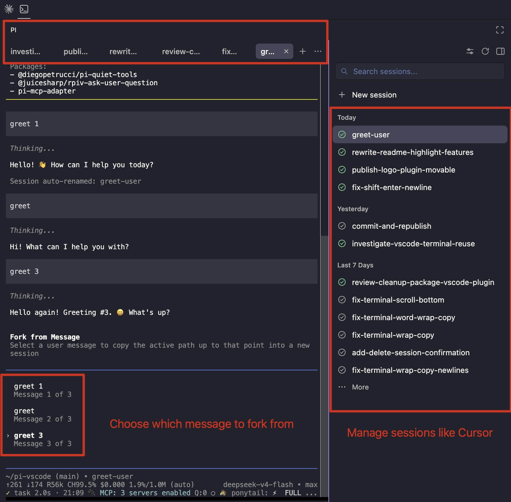

# Pi VS Code Fork

`/fork-with-vscode` creates a new Pi session from any earlier user message.



> This package requires [Pi Coding for VS Code](https://marketplace.visualstudio.com/items?itemName=EthanChow.pi-coding). It is not a standalone terminal command: the VS Code extension creates the terminal, maintains the session list, and provides the local bridge.

## Pi Coding for VS Code

Pi Coding provides the VS Code half of the workflow:

1. **Live Pi status.** See whether each session is working, waiting for input, or stopped, similar to Herdr.
2. **Open files from Pi output.** Command-click a path on macOS, or Ctrl-click on Windows and Linux, to open the file in VS Code. Line and column locations are supported.
3. **Workspace session management.** Browse, resume, archive, close, and delete Pi sessions for the current workspace in a session list similar to Cursor.

Install the companion extension from the [VS Code Marketplace](https://marketplace.visualstudio.com/items?itemName=EthanChow.pi-coding).

## Install

```bash
pi install npm:pi-vscode-fork
```

Start a new Pi session from Pi Coding after installation. Pi loads this package from its own package settings; the VS Code extension does not bundle or inject the command.

## Use

1. Open a workspace in VS Code and start a Pi session with Pi Coding.
2. Send at least one message so Pi has a session transcript.
3. Run `/fork-with-vscode`.
4. Select the user message at which the new session should begin.

The new session keeps the conversation before the selected message, opens in VS Code, and receives focus. The selected message is placed in its input box and is not sent automatically. The title is copied from the source session with a sibling-fork prefix, for example `(1) Investigate cache miss` or `(2) Investigate cache miss`.

## License

[MIT](LICENSE)
